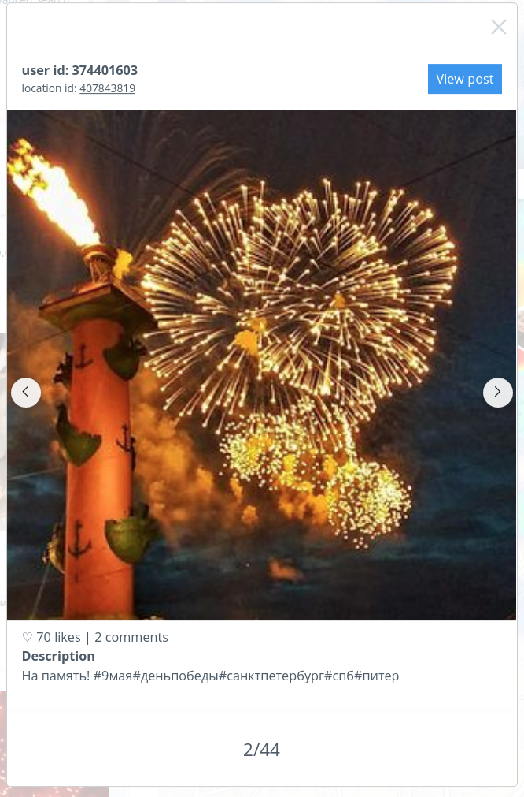

# User Interface

The service shows the result of the automatic search of city events (concerts, sports games, quests, etc.) 
based on data from the social network Instagram. Each found event is a set of posts close in time of publication, 
location and thematically.  
[Original algorithm](https://dl.acm.org/doi/10.1145/3282866.3282867).

The main components of the interface are:
- [Login page](#login-page)
- [City selection](#city-selection) - page with selection of interested city.
- [Map](#map) - map with [heatmap layer](#heatmap) and [events layer](#events-on-map).
- [Sidebar](#sidebar) or [Advanced sidebar](#advanced-sidebar) - parameters of searching 
and filtering of events.

## Login page

Page with login and password fields.  
Note: When you refresh the resource page or change the url manually while working with the application, 
the page opens again.When you refresh the resource page or change the url manually while working with the application, 
the page opens again.

## City selection
This page allows you to select the city of interest, to search for events.

## Map
The map contains the following components:
- Heatmap of the number of publications
- Events
  

### Heatmap 

It  shows the number of publications for a given period of time (hour or day).  
Note: It is displayed only for the Base mode.

  
  

### Events on map

For each event, the map displays a photo of one of the posts and its name - the most popular hashtag. 
Also, on the event card can be a number with "+", it means that in this area is a group of events and only one 
of them is displayed, to see them, you need to zoom the map or click on the event and then the scale will change 
automatically to the grouped events are separated. If you click on an individual event (without the "+" symbol), 
the event window opens.

## Event window

Main information about posts in the event.

## Base mode

Designed to display all events on the map and the number of publications for the selected day or hour. 
It displays events and the heatmap on the map.  
It is the default choice when user starts the application.

### Sidebar

Contains search settings, filtering, timeline, and found events.

#### Timeline

Shows how many events were published (gray) and how many events were found (orange) foreach hour of the 
selected day. In order to select a particular hour for which you want to show events and a heatmap of publications, 
you need to click on the appropriate column in the timeline chart. In order to show the events for the whole day - 
press the button "all period", to return to the selection of a specific hour, you need to press this button again. 
It is also possible to enable a slideshow of changes in the number of publications and events from the selected hour 
to the end of the day using the "play timeline" button.

#### Search bar

Designed to manage search results.

##### Next and previous day

The next, previous day buttons below the "timeline" switch the day.

##### Search panel

Performs filtering for found events, the results, the events are filtered only in Sidebar, the changes are 
not displayed on the Map. Filtration is carried out on occurrence of the given substring in the list of hashtags 
of the event, i.e. if at least one hashtag contains as a substring a string specified by the user, such event is 
displayed, otherwise not.

##### Data selection

It allows any date for displaying events and other information, the changes are displayed 
on all elements of the interface.

##### Sort selection

Allows you to sort events by one of the available criteria (critical popularity is evaluated by the amount of likes). 
By default, events are presented in random order. 

#### Events bar

It displays search results, filtering and sorting events, For each event you can see a photo of one of the posts, 
its name, a list of related hashtags, the start date and the end date. When you click on the event itself, the map 
shifts and scales to show exactly where the event took place. Clicking on "View all posts" opens the event window.

## Advanced mode

Designed to display events over a selected period of time and corresponding to the user-defined criteria.  
It displays only events on the map.

### Advanced sidebar

Contain controls for advanced event search and display.

#### Search params

Sets the search parameters by hashtags related to events and by the Instagram account's mindset. 
To add a hashtag, write it in the hashtag field (the presence or absence of the '#' symbol at the beginning of the 
hashtag does not affect the result) and click "+". Hashtags and mentions are added according to the logical "AND" rule. 
For search, it is necessary to set at least one criterion. An empty field does not participate in the search.
The fields for the beginning and the end, for the considered interval for which the events are analyzed, and the button 
of event search are located at the bottom.

#### Advanced Events bar

Same as general [Events bar](#events-bar) 

#### Filters section

Same as [Search panel](#search-panel) + [Sort selection](#sort-selection) + 
[Event bar](#events-bar) from base mode. 

